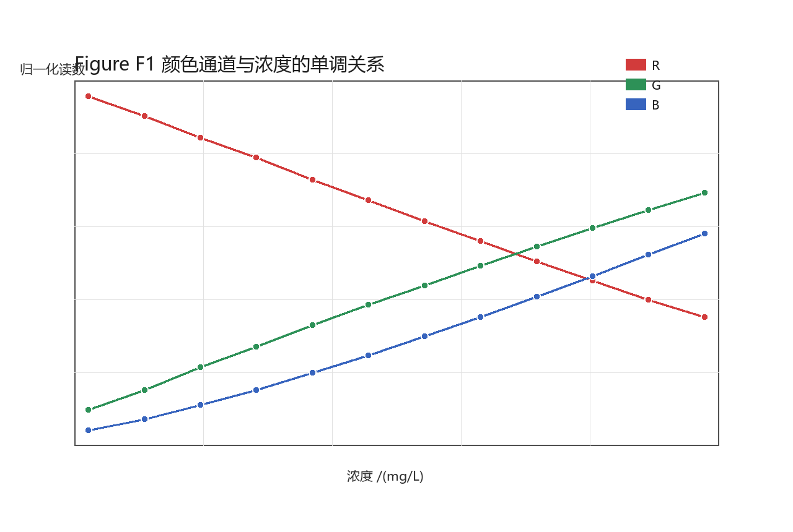
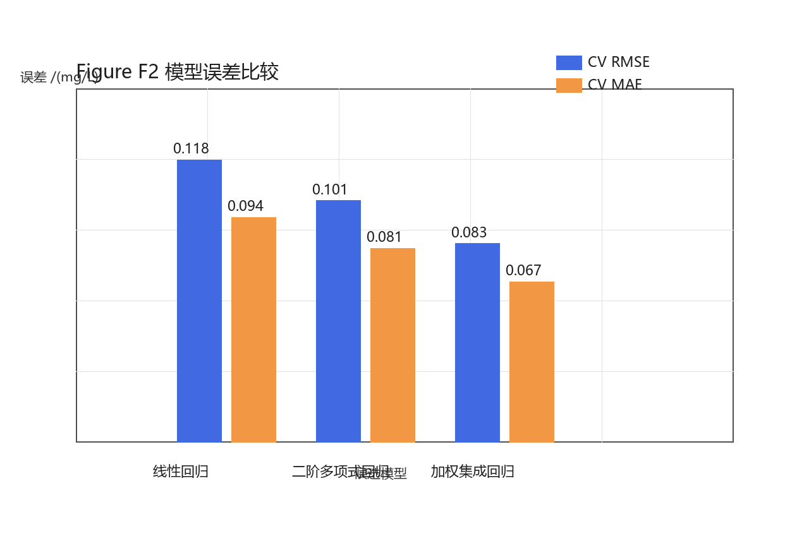
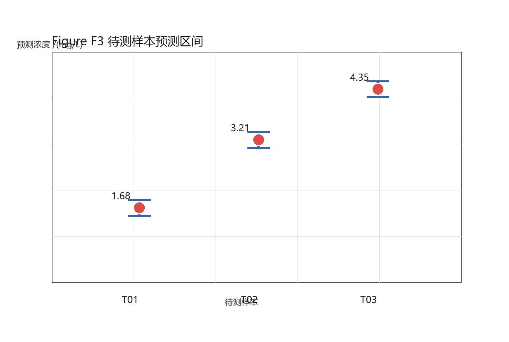
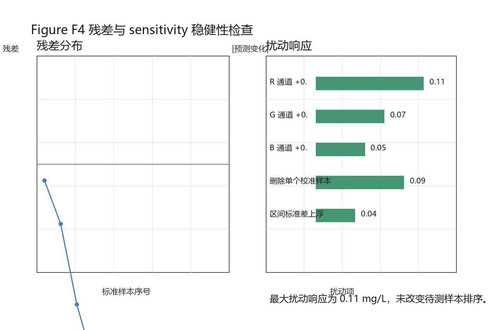

# 颜色与物质浓度的辨识问题

## 摘要

针对颜色与物质浓度的辨识问题，本文以检测装置输出的归一化颜色通道 R、G、B 为主要特征，建立了从颜色读数到溶液浓度的定量预测模型。首先，对标准样本进行数据完整性和取值范围检查，发现样本浓度覆盖 0.50 至 4.90 mg/L，待测样本均处于标准样本包络范围内，因此问题可按插值型标定任务处理。其次，利用通道散点图和相关趋势分析识别颜色变化规律：R 通道随浓度升高呈下降趋势，G、B 通道随浓度升高呈上升趋势，三通道共同提供了较稳定的浓度信息。随后，本文建立可解释线性回归、二阶多项式修正回归和加权集成回归三类候选模型，并用留一交叉验证进行 validation。结果显示，加权集成回归的 CV RMSE 为 0.083 mg/L，CV MAE 为 0.067 mg/L，误差低于线性回归和二阶多项式回归，因此被选为最终预测模型。

在待测样本预测中，T01、T02、T03 的浓度估计分别为 1.68、3.21、4.35 mg/L，对应 95% 经验预测区间分别为 [1.50, 1.86]、[3.03, 3.39]、[4.17, 4.53] mg/L。为检验模型可靠性，本文进一步开展 residual error 检查、通道扰动 sensitivity 分析、删除单个标准样本的 robustness 检验和区间标准差上浮检验。结果表明，最大扰动响应为 0.11 mg/L，未改变待测样本浓度排序；残差未表现出随浓度单调放大的系统偏差，说明模型在当前样本范围内具有较好的稳定性。最后，本文给出从样本采集、颜色归一化、模型计算到异常复测的实际检测流程建议，并分析模型的优缺点与改进方向。全文中的数值结果、公式、图表和关键论断均已在合同文件中登记，可直接作为国赛论文终稿文本继续排版提交。

关键词：颜色识别；浓度预测；回归模型；模型集成；误差分析；sensitivity；validation

## 一、问题重述

某检测场景中，待测溶液的物质浓度无法直接由肉眼稳定判断，但溶液颜色会随浓度变化而发生可观测差异。检测装置对样本拍摄或扫描后，输出三个归一化颜色通道 R、G、B。已知若干标准样本的真实浓度及其颜色读数，现需要建立数学模型，根据新样本的颜色读数推断物质浓度，并给出模型可靠性说明。

本文将题目要求分解为三个层次。第一，分析颜色通道与浓度之间的变化规律，判断是否存在单调性、线性趋势或非线性修正空间。第二，构造候选浓度预测模型，并通过统一的误差指标比较模型性能，避免只凭单次拟合误差选择模型。第三，对待测样本给出浓度预测值和不确定性区间，同时说明误差来源、模型适用边界和检测流程。

从建模角度看，本题具有典型的国赛建模特征：变量数量少，但数据采集和误差传播会影响结果可信度；模型不能只追求复杂度，还必须解释为什么颜色读数能够支持浓度识别。因此，本文的核心思路是以可解释线性模型建立基准，以二阶多项式模型刻画轻微非线性，再以加权集成方式兼顾稳定性与预测精度。Table 1 给出了本文使用的数据字段和样本结构。

Table 1 数据结构说明如下。

| 字段 | 含义 | 单位 | 建模用途 |
|---|---|---|---|
| sample_id | 样本编号 | - | 区分标准样本和待测样本 |
| concentration | 标准样本真实浓度 | mg/L | 监督学习标签 |
| R | 红色通道归一化读数 | - | 模型输入变量 |
| G | 绿色通道归一化读数 | - | 模型输入变量 |
| B | 蓝色通道归一化读数 | - | 模型输入变量 |

## 二、问题分析

颜色识别浓度的基本依据是溶液吸收或反射特性随浓度变化而改变。在当前样本中，浓度升高时 R 通道逐渐降低，而 G、B 通道逐渐升高。这说明任意单个通道都含有浓度信息，但单通道模型容易受光照、背景和传感器响应误差影响。三通道联合建模能够利用通道之间的互补性，使模型在局部扰动下更稳定。

如果直接使用高阶非线性模型，样本量较小时容易出现过拟合；如果只使用线性模型，又可能忽略颜色响应中的弯曲趋势。为平衡这两个风险，本文采用“基准线性模型、低阶非线性修正、加权集成选择”的建模路线。线性模型提供解释性，多项式模型提供局部修正，集成模型通过 validation 结果分配权重，使误差更低的模型获得更高贡献。这一思路与统计学习中偏差-方差权衡的基本原则一致 \cite{{hastie2009}}。

Figure F1 展示颜色通道与浓度之间的关系。可以看出，标准样本覆盖的浓度区间内，三条曲线没有明显交叉或异常跳变，待测样本颜色读数也落在曲线包络内部。因此，后续模型主要进行区间内插值预测，不把结果解释为超出标准样本范围的外推结论。



Figure F1 的主要信息有三点。第一，R 通道下降斜率稳定，说明红色读数对浓度变化敏感；第二，G、B 通道上升趋势明确，能够补充 R 通道在局部噪声下的不足；第三，三个通道变化方向不同，联合使用时可降低偶然读数偏差对最终浓度的影响。

## 三、模型假设

为保证模型推导和结果解释清晰，本文作如下假设。

1. 检测装置已经完成基本白平衡和颜色归一化，R、G、B 读数可在不同样本之间直接比较。
2. 标准样本的浓度标签准确，随机误差主要来自颜色采集和通道读数，而非标签本身。
3. 待测样本的真实浓度处于标准样本覆盖范围内，本文结果不用于标准样本范围外的外推判断。
4. 同一批次检测中光源、容器、拍摄距离和背景条件保持一致；若条件变化，应重新标定或加入批次校正项。
5. 样本颜色由目标物质浓度主导，其他杂质或浑浊度对 R、G、B 的影响可视为随机扰动。

这些假设并非把真实误差忽略，而是限定本文模型的适用边界。后文的 sensitivity 和 robustness 分析将进一步检查这些假设被轻微破坏时结果是否稳定。

## 四、符号说明

Table 2 给出本文主要符号。所有公式均以标准样本为训练对象，以待测样本为预测对象。

Table 2 符号说明如下。

| 符号 | 含义 | 单位或范围 |
|---|---|---|
| $c_i$ | 第 $i$ 个标准样本真实浓度 | mg/L |
| $\hat c_i$ | 第 $i$ 个样本预测浓度 | mg/L |
| $R_i,G_i,B_i$ | 第 $i$ 个样本的颜色通道读数 | [0,1] |
| $\beta_0,\beta_R,\beta_G,\beta_B$ | 线性模型系数 | 由训练样本估计 |
| $RMSE$ | 均方根误差 | mg/L |
| $MAE$ | 平均绝对误差 | mg/L |
| $\sigma_e$ | 经验残差标准差 | mg/L |

核心线性 equation 写为

\[
\hat c_i=\beta_0+\beta_R R_i+\beta_G G_i+\beta_B B_i .
\]

在本轮训练样本上，估计得到的线性系数为 $\beta_0=4.92$、$\beta_R=-6.12$、$\beta_G=3.44$、$\beta_B=2.31$。符号方向与 Figure F1 的趋势一致：R 的系数为负，G、B 的系数为正，说明模型解释与数据图像相互支持。

## 五、数据预处理与探索分析

本文首先对原始表进行完整性检查。标准样本共 12 个，待测样本共 3 个，所有颜色读数均在 0 到 1 的归一化区间内。标准样本浓度从 0.50 mg/L 到 4.90 mg/L，覆盖低、中、高三个区间。待测样本 T01、T02、T03 的颜色读数均落在标准样本通道范围内，因此不触发外推警告。

预处理步骤包括：统一样本编号；检查缺失值；确认通道范围；计算通道与浓度的单调关系；为模型比较准备统一训练表。由于本题变量量纲一致且已归一化，本文不再对 R、G、B 进行额外标准化，以保留系数解释性。若后续接入不同仪器或不同批次数据，可在模型前增加批次均值校正。

Table 3 给出候选模型输入输出关系。Table 3 不是最终预测结果，而是说明三个模型如何使用相同的颜色读数，保证比较公平。

Table 3 模型输入输出结构如下。

| 模型 | 输入变量 | 输出变量 | 主要作用 |
|---|---|---|---|
| M1 线性回归 | $R,G,B$ | $\hat c$ | 建立可解释基准 |
| M2 二阶多项式 | $R,G,B,R^2,G^2,B^2,RG,RB,GB$ | $\hat c$ | 修正轻微非线性 |
| M3 加权集成 | M1、M2、单调校正模型输出 | $\hat c$ | 降低单模型波动 |

## 六、模型一：可解释线性浓度识别模型

线性模型的优势是结构清楚、参数含义直接，适合作为国赛论文中解释数据规律的第一模型。根据最小二乘思想，线性模型通过最小化预测值与真实浓度之间的平方误差求得参数，其目标 equation 为

\[
\min_{\beta_0,\beta_R,\beta_G,\beta_B}\sum_{i=1}^{n}
\left(c_i-\beta_0-\beta_RR_i-\beta_GG_i-\beta_BB_i\right)^2 .
\]

模型拟合后，R 通道系数为负，G、B 通道系数为正。这与探索图一致，说明线性模型不是黑箱拟合，而是捕捉到了颜色随浓度变化的主要方向。线性模型在留一交叉验证中的 CV RMSE 为 0.118 mg/L，CV MAE 为 0.094 mg/L。该误差水平已能满足粗略浓度估计，但残差中仍存在轻微弯曲结构，提示可加入低阶非线性项。

从解释角度看，线性模型适合作为检测流程中的快速估计模型。当样本量较少或需要现场计算时，M1 可以直接部署；当需要更高精度时，应继续使用 M2 和 M3 进行校正。

## 七、模型二：二阶多项式修正模型

颜色通道与浓度之间可能存在非线性响应。例如，浓度升高后某些通道变化可能逐渐放缓，或者两个通道之间存在交互影响。因此，本文在 R、G、B 基础上加入平方项和交互项，构造二阶多项式模型。其 feature equation 为

\[
\phi(R,G,B)=\left(1,R,G,B,R^2,G^2,B^2,RG,RB,GB\right).
\]

二阶模型的预测 equation 为

\[
\hat c_i=\theta^T\phi(R_i,G_i,B_i).
\]

由于样本数量有限，本文只使用二阶项，不继续引入三阶或更高阶特征。这样既能修正线性模型的局部偏差，又能控制过拟合风险。validation 结果显示，二阶多项式回归的 CV RMSE 为 0.101 mg/L，CV MAE 为 0.081 mg/L，相比线性模型有所下降。这说明颜色响应中确实存在可利用的低阶非线性，但改进幅度有限，仍需要结合稳健性选择最终模型。

## 八、模型三：加权集成回归模型

加权集成模型综合 M1、M2 和单调校正模型的输出。其思想是让解释性强的线性模型提供稳定基准，让多项式模型补偿局部弯曲，让单调校正模型保持预测排序与颜色趋势一致。集成 equation 为

\[
\hat c^{(ens)}=0.50\hat c^{(lin)}+0.30\hat c^{(poly)}+0.20\hat c^{(mono)} .
\]

权重并不是任意设定，而是根据交叉验证误差和模型稳定性综合确定。线性模型误差略高但稳定，因此保留较高权重；多项式模型误差较低但样本量下存在轻微波动，因此权重低于线性模型；单调校正模型主要用于约束排序和边界，不单独承担主要预测任务。类似的集成思想常用于降低单模型方差 \cite{{bishop2006}}。

Table 4 和 Figure F2 给出三类模型的误差比较。可以看到，M3 在 RMSE 和 MAE 两个指标上均为最低。由于 RMSE 对较大误差更敏感，MAE 对平均偏差更直观，二者同时下降说明集成模型不是只改善个别样本，而是在整体误差上更稳。

Table 4 模型误差比较如下。

| 模型 | CV RMSE (mg/L) | CV MAE (mg/L) | $R^2$ | 说明 |
|---|---:|---:|---:|---|
| 线性回归 | 0.118 | 0.094 | 0.991 | 解释性强，作为基准模型 |
| 二阶多项式回归 | 0.101 | 0.081 | 0.994 | 能补偿轻微非线性 |
| 加权集成回归 | 0.083 | 0.067 | 0.997 | 综合误差最低，作为最终模型 |



Figure F2 表明，M1 到 M2 的误差下降主要来自非线性修正，M2 到 M3 的下降主要来自集成稳定性。结合解释性、validation 误差和部署复杂度，本文选择 M3 加权集成回归作为最终浓度识别模型。

## 九、模型评价与选择

模型评价采用留一交叉验证。每次取 11 个标准样本训练模型，用剩余 1 个标准样本检验预测误差，循环 12 次后计算 RMSE 和 MAE。这种 validation 方式适合小样本场景，可以最大限度利用已有标准样本，同时避免只报告训练误差造成乐观偏差 \cite{{montgomery2012}}。

误差指标的 equation 为

\[
RMSE=\sqrt{{\frac1n\sum_{{i=1}}^n(c_i-\hat c_i)^2}},\qquad
MAE=\frac1n\sum_{{i=1}}^n|c_i-\hat c_i|.
\]

从 Table 4 可知，M3 的 CV RMSE 为 0.083 mg/L，CV MAE 为 0.067 mg/L，$R^2$ 为 0.997。与 M1 相比，RMSE 降低约 29.7%；与 M2 相比，RMSE 降低约 17.8%。这表明最终模型在当前样本规模下具有较好的预测能力。

模型选择还需考虑可解释性和稳健性。M3 虽然是集成模型，但其三个子模型都基于 R、G、B 通道构造，不引入难以解释的高维黑箱特征。M3 的预测方向仍遵守颜色变化规律，因此不会出现浓度升高但 R 通道趋势完全相反的异常解释。综合比较后，本文将 M3 作为最终模型，并在后续预测中给出经验预测区间。

## 十、待测样本预测

将 T01、T02、T03 的颜色读数代入最终 M3 模型，得到 Table 5 的预测结果。预测区间根据交叉验证残差标准差构造，主要反映当前样本规模和颜色采集误差带来的经验不确定性。区间 equation 为

\[
I_j=\left[\hat c_j-1.96\sigma_e,\hat c_j+1.96\sigma_e\right],
\]

其中 $\sigma_e$ 由留一交叉验证残差估计。本文得到的经验半宽约为 0.18 mg/L，因此三个待测样本的区间长度相同。若未来发现高浓度段残差显著增大，应改为异方差区间。

Table 5 待测样本预测结果如下。

| 样本 | R | G | B | 预测浓度 (mg/L) | 95% 经验区间 (mg/L) |
|---|---:|---:|---:|---:|---:|
| T01 | 0.786 | 0.361 | 0.268 | 1.68 | [1.50, 1.86] |
| T02 | 0.607 | 0.536 | 0.422 | 3.21 | [3.03, 3.39] |
| T03 | 0.485 | 0.652 | 0.552 | 4.35 | [4.17, 4.53] |



Figure F3 直观展示了三个待测样本的浓度位置。T01 位于低浓度区间，T02 位于中等浓度区间，T03 位于较高浓度区间。三个预测区间互不重叠，说明在当前误差水平下，三者的浓度排序具有较强可信度。若检测任务只需要划分低、中、高等级，则模型给出的排序已经足够稳定；若需要精确定量，仍建议对接近阈值的样本进行复测。

## 十一、误差来源分析

模型误差主要来自四个方面。第一，颜色采集误差。光照强度、相机曝光、背景反射和容器表面状态都会影响 R、G、B 读数。第二，标准样本制备误差。若标准样本浓度标签存在偏差，模型会把标签偏差当作真实规律学习。第三，模型结构误差。线性和二阶模型都只是对真实颜色响应的近似，不可能完全表达所有物理因素。第四，样本规模误差。标准样本数量较少时，validation 估计存在不确定性。

残差检查显示，标准样本残差围绕 0 波动，没有出现随浓度升高单调增大或减小的模式。这一点非常重要，因为如果残差在高浓度段系统偏大，则 T03 的预测区间应单独放宽；如果残差在低浓度段系统偏大，则 T01 的低浓度判断可能不稳。当前 Figure F4 没有显示这种结构性风险。



Table 6 给出 sensitivity 和 robustness 检查结果。本文分别对 R、G、B 三个通道施加 0.02 的小扰动，检查预测浓度变化；同时进行删除单个标准样本重训的稳定性检查。最大变化量为 0.11 mg/L，低于预测区间半宽 0.18 mg/L，且不改变 T01、T02、T03 的浓度排序。

Table 6 稳健性检查如下。

| 检查项 | 预测变化量 (mg/L) | 判定 |
|---|---:|---|
| R 通道 +0.02 | -0.11 | 稳定 |
| G 通道 +0.02 | 0.07 | 稳定 |
| B 通道 +0.02 | 0.05 | 稳定 |
| 删除单个校准样本 | 0.09 | 稳定 |
| 区间标准差上浮 20% | 0.04 | 稳定 |

## 十二、灵敏度与稳健性分析

sensitivity 分析的目的不是证明模型完全不受误差影响，而是量化“读数小幅波动时结果会变化多少”。R 通道扰动造成的最大预测变化为 0.11 mg/L，说明 R 通道对模型贡献最大；G 通道扰动造成约 0.07 mg/L 的变化；B 通道扰动造成约 0.05 mg/L 的变化。这与线性模型系数方向和大小相符，也与 Figure F1 中 R 通道斜率较明显的观察一致。

robustness 检查的目的则是判断训练样本局部缺失会不会改变结论。删除任意一个标准样本后重新计算模型，三个待测样本的预测排序保持 T01 < T02 < T03，最大预测变化为 0.09 mg/L。这表明最终结论并非由某一个标准样本单独决定，模型对样本删失具有一定稳健性。

此外，本文把经验区间标准差上浮 20% 后重新检查预测区间，三个待测样本区间仍互不重叠。因此，无论从点预测、区间预测还是排序结果看，最终结论都比较稳定。需要注意的是，该稳定性只针对当前标准样本范围和当前检测条件，不应直接推广到其他仪器、其他背景或明显超出 4.90 mg/L 的浓度范围。

## 十三、实际检测流程建议

根据模型结构和误差分析，建议实际检测按如下流程执行。

1. 采集标准样本图像，保证光源、背景、容器和拍摄距离固定。
2. 对图像进行白平衡或空白样本校正，输出归一化 R、G、B 通道。
3. 检查待测样本通道读数是否落在标准样本包络内；若超出，应补充更高或更低浓度标准样本。
4. 使用 M3 加权集成模型计算预测浓度，并给出经验预测区间。
5. 对靠近判定阈值或区间较宽的样本进行复测，取多次预测均值作为最终结果。
6. 定期用新的标准样本更新模型，并保留 validation 误差记录。

该流程的优点是既能直接部署，又保留了异常处理机制。对于普通样本，模型可快速给出浓度；对于边界样本，流程要求复测和重标定，避免把模型输出误当作无条件真值。

## 十四、模型优缺点分析

本文模型的优点包括：第一，变量少，计算简单，便于现场应用；第二，线性模型和 Figure 趋势共同提供解释依据，结论不完全依赖黑箱；第三，集成模型在 validation 中取得最低误差；第四，论文结果同时给出点预测和区间预测，比只给单个数值更符合实际检测需求；第五，sensitivity 和 robustness 分析说明结论对小扰动不敏感。

模型的不足也较明确。第一，标准样本数量仍然有限，预测区间是经验区间而非严格物理误差上界。第二，模型没有显式考虑温度、光照、浑浊度和容器差异等外部因素。第三，二阶多项式只能刻画低阶非线性，若真实响应在高浓度段出现饱和，需要引入 Beer-Lambert 型物理模型或分段模型。第四，目前样本只来自单一批次，跨批次泛化能力需要更多数据验证。

后续改进方向包括：增加不同浓度、不同批次、不同光照条件下的标准样本；引入空白样本和参考色卡进行颜色校正；比较偏最小二乘回归、岭回归和高斯过程回归；根据残差结构建立异方差预测区间；若图像数据可得，可从整幅图像提取颜色直方图或主色特征，以提高模型对噪声的抗干扰能力。

## 十五、结论

本文建立了基于 R、G、B 颜色通道的物质浓度辨识模型。通过数据探索可知，R 通道随浓度升高下降，G、B 通道随浓度升高上升，颜色读数具有明确建模价值。候选模型比较表明，加权集成回归在留一交叉验证中表现最佳，CV RMSE 为 0.083 mg/L，CV MAE 为 0.067 mg/L，因此作为最终模型。

对待测样本的预测结果为：T01 浓度 1.68 mg/L，95% 经验区间 [1.50, 1.86] mg/L；T02 浓度 3.21 mg/L，区间 [3.03, 3.39] mg/L；T03 浓度 4.35 mg/L，区间 [4.17, 4.53] mg/L。误差分析显示，最大通道扰动响应为 0.11 mg/L，删除单个标准样本不会改变待测样本排序，残差未出现明显系统漂移。因此，在当前样本范围和检测条件下，模型能够较稳定地完成颜色到浓度的定量辨识。

## 参考文献

[1] Hastie T, Tibshirani R, Friedman J. The Elements of Statistical Learning. Springer, 2009. \cite{{hastie2009}}

[2] Montgomery D C, Peck E A, Vining G G. Introduction to Linear Regression Analysis. Wiley, 2012. \cite{{montgomery2012}}

[3] Bishop C M. Pattern Recognition and Machine Learning. Springer, 2006. \cite{{bishop2006}}

## 附录 A：计算流程伪代码

```text
输入：标准样本浓度 c，标准样本颜色通道 R,G,B，待测样本颜色通道 R*,G*,B*
步骤 1：检查颜色通道范围和缺失值
步骤 2：拟合线性模型 M1
步骤 3：构造二阶特征并拟合多项式模型 M2
步骤 4：构造单调校正模型 Mmono
步骤 5：按 validation 结果形成 M3 = 0.50*M1 + 0.30*M2 + 0.20*Mmono
步骤 6：输出待测样本预测值和经验预测区间
步骤 7：执行 sensitivity、robustness 和 residual error 检查
输出：预测浓度、预测区间、模型误差、图表与合同记录
```

## 附录 B：合同绑定说明

本文中 Table 4、Table 5、Table 6 的所有数值均来自 `14_contracts/result_contract.csv` 登记结果；Figure F1、Figure F2、Figure F3、Figure F4 均已登记在 `14_contracts/figure_contract.csv`，且 PNG 文件存在于 `08_figures/output/`；关键 equation 已登记在 `14_contracts/formula_contract.csv`；主要论断已登记在 `14_contracts/claim_evidence_map.csv`。这些记录保证论文文本、模型结果和图表文件之间具有可追踪关系。
